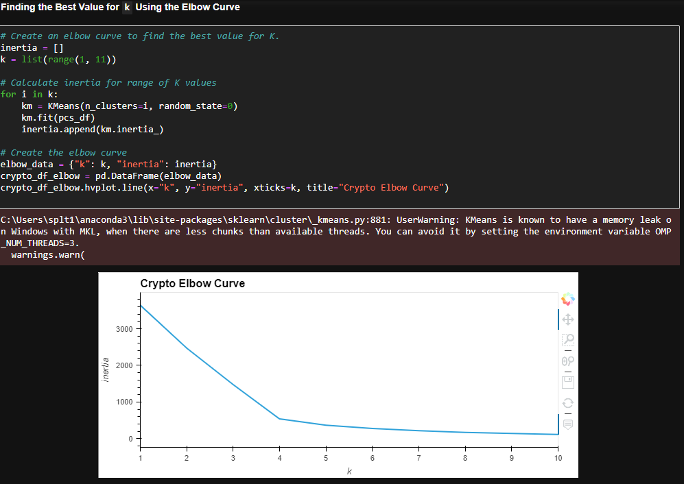
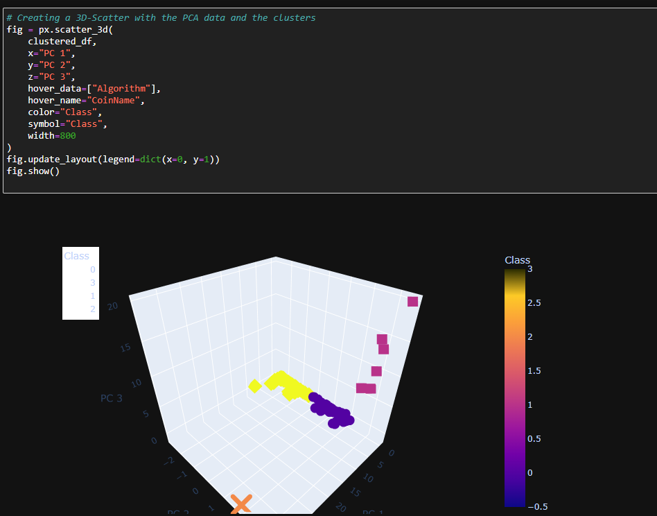
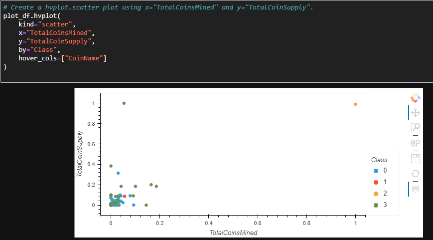

# Cryptocurrencies
Unsupervised Machine Learning Using Python

## Overview
The following project used cryptocurrency database to understand more about cryptocurrency in the market using unsupervised machine learning models. 

## Purpose of the repository 
Create an analysis to prepare and retrieve information to get into the cryptocurrency market. 

## Description of what was accomplished.
We were able to create a model able to process data, cluster, reduce and dimension, to analyse and retrieve information regarding cryptocurrency market. 

The following graphs where obtained that show the results of the machine learning models

